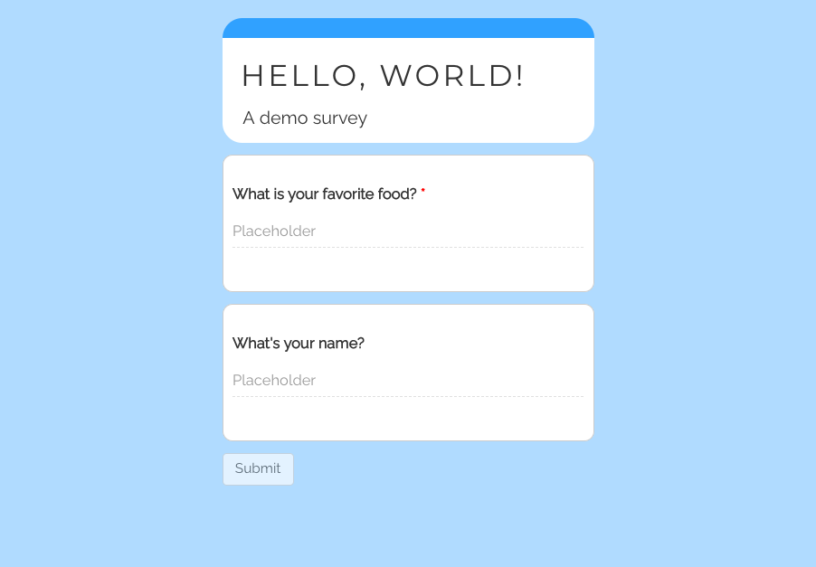
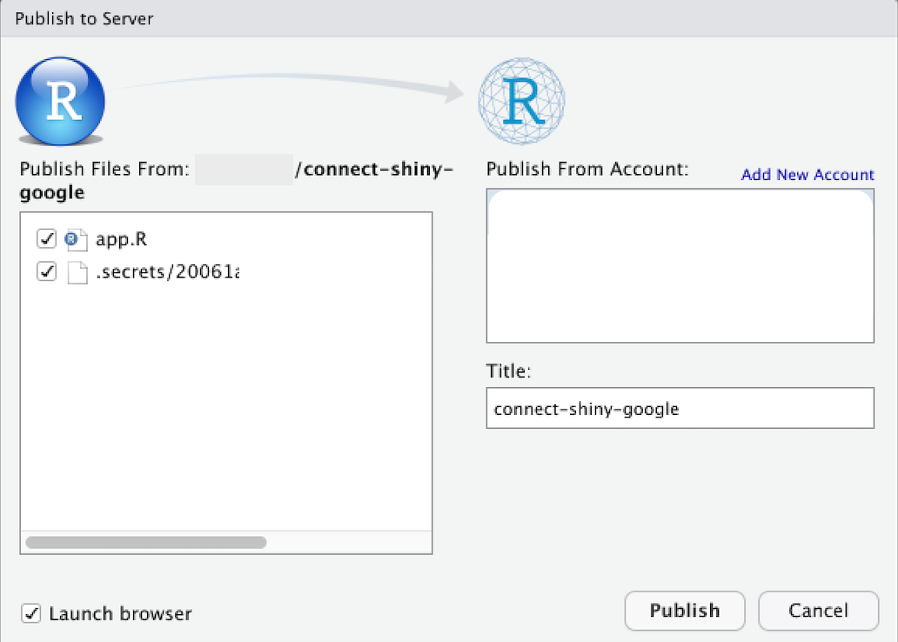

```{r setup, include=FALSE}
knitr::opts_chunk$set(echo = TRUE)
```

## Introduction

Do you have a shiny application? Do you want to save data? Do you like reading blog posts? Well, you're in luck! There are quite a few options for storing data collected in a Shiny application. For easily sharing said data with (perhaps non-technical) clients, I like using Google Drive, Dropbox, or Box.com. Fortunately, there are amazing packages that allow you to connect to these services ([`googledrive`](http://googledrive.tidyverse.org/), [`rdrop2`](https://github.com/karthik/rdrop2), and [`boxr`](https://r-box.github.io/boxr/index.html)). Some of these, and many other options for saving data from a shiny application, are discussed in this this [fantastic article](https://shiny.rstudio.com/articles/persistent-data-storage.html) by Dean Attali. In this post, I hope to highlight an easy way for saving data to Google Drive and/or Google Sheets. This is done with a non-interactive token.[^1]

[^1]: For an alternative description of how to use non-interactive tokens (perhaps less "shiny" focused, please see [this article](https://gargle.r-lib.org/articles/non-interactive-auth.html).

A token, like those used in arcade games, can be thought of as a coin. One side stores a username and the other a password. Multiple tokens, with different permissions, can provide access to a given account. They can be easily shared (e.g. as a JSON file) and allow access to applications, such as Google Drive, without requiring a person login manually. With an understanding

> **DISCLAIMER:** I am not a security expert. The method described below could potentially allow certain parties to access your authorization token and, subsequently, your data. As an independent developer, however, I have not found a more secure manner, and do believe this is a useful solution.

## Storing Data

### Setting up an Application

As a sample application, consider the use of my package, [shinysurveys](https://github.com/jdtrat/shinysurveys), which provides easy-to-use, minimalistic code for creating and deploying surveys with shiny. The following code will generate a shiny application that asks for your favorite food and your name.

Those who have used shinysurveys before know that a "Submit" button is built in to the package, but no actions are defined. So, when a user completes the survey, the app designer can specify what happens upon submission. In this case, we want to save the data to Google Drive. First, we will store it as a data frame `response_data`. This can be done with the `get_survey_data()` function from shinysurveys, which aggregates all responses in a tidy format. The code for this is below:

```{r demo-survey, eval = FALSE}
# Load packages
library(shiny)
library(shinysurveys)

# Define questions in the format of a shinysurvey
survey_questions <- data.frame(
  question = c("What is your favorite food?",
               "What's your name?"),
  option = NA,
  input_type = "text",
  input_id = c("favorite_food", "name"),
  dependence = NA,
  dependence_value = NA,
  required = c(TRUE, FALSE)
)

# Define shiny UI
ui <- fluidPage(
  surveyOutput(survey_questions,
               survey_title = "Hello, World!",
               survey_description = "A demo survey")
)

# Define shiny server
server <- function(input, output, session) {
  renderSurvey()
  
  observeEvent(input$submit, {
    response_data <- get_survey_data()
  })
}

# Run the shiny application
shinyApp(ui, server)

```

When run in the browser, this looks like:



### Authenticating Google Drive

In order to save the data to Google Drive, we must use the package `googledrive`. In this example, I will actually save the data to Google Sheets, however, and will also load [`googlesheets4`](http://googlesheets4.tidyverse.org/). Under the hood, these packages use [`gargle`](https://gargle.r-lib.org) to handle user authentication. As mentioned, we want to use a cached, non-interactive token for shiny applications to connect to our Google Drive account. With the goal of deploying this on [shinyapps.io](https://shinyapps.io) order to do this, we need to set some gargle options. I would recommend running this in your "app.R" file.

```{r set-gargle-options, eval = FALSE}

options(
  # whenever there is one account token found, use the cached token
  gargle_oauth_email = TRUE,
  # specify auth tokens should be stored in a hidden directory ".secrets"
  gargle_oauth_cache = "your-app-folder-name/.secrets"
)

```

With these options set, run the command `googledrive::drive_auth()` in order to login and cache your auth token for use with your deployed shiny application.[^2] And voila! You should have a hidden folder ".secrets" that contains your token file. To check, you can use `list.files("your-app-folder-name/.secrets/")`.

[^2]: Note: you may need to run the command `googlesheets4::gs4_auth()` in order to save the auth token for writing files to Google Sheets in addition to Google Drive.

> Note that the ".secrets" folder contains sensitive information and **should NOT** be committed to version control systems such as GitHub. To avoid this, you can add it to your .gitignore file manually or as follows: `use_git_ignore("your-app-folder-name/.secrets/")`.

For more detailed documentation on caching auth tokens, please see [this vignette](https://gargle.r-lib.org/articles/non-interactive-auth.html#arrange-for-an-oauth-token-to-be-re-discovered).

### Setting up a Google Sheet

In order to save the user data to Google Sheets, we must first create a sheet. This can be done manually in the browser or programmatically as follows:

```{r setup-google-sheets, eval = FALSE}

# Run once on set up
googlesheets4::gs4_create(name = "your-sheet-name", 
           # Create a sheet called main for all data to 
           # go to the same place
           sheets = "main")

```

### Writing to your Google Sheet

Recall that, in our app, we want to write the data from our survey. We have already created a Google Sheet and now we need to write our survey data to it. To do that, we need a sheet id, which we can get with the following code:

```{r get-sheet-id, eval = FALSE}

# Get the ID of the sheet for writing programmatically
# This should be placed at the top of your shiny app
sheet_id <- googledrive::drive_get("your-sheet-name")$id

```

Let's modify our server portion as follows. We first read in our sheet data, then check to see whether it contains existing responses. If not, we will write the first entry to set up the column names appropriately. If it has data, we will simply append responses to it.

```{r write-sheet-data, eval = FALSE}

# Define shiny server
server <- function(input, output, session) {
  renderSurvey()
  
  observeEvent(input$submit, {
    response_data <- get_survey_data()
    
    # Read our sheet
    values <- read_sheet(ss = sheet_id, 
                         sheet = "main")
    
    # Check to see if our sheet has any existing data.
    # If not, let's write to it and set up column names. 
    # Otherwise, let's append to it.
    
    if (nrow(values) == 0) {
      sheet_write(data = response_data,
                  ss = sheet_id,
                  sheet = "main")
    } else {
      sheet_append(data = response_data,
                   sheet = "main")
    }
    
  })
  
}


```

Excluding the sheet creation function, which is only run once, our full shiny application is as follows:

```{r full-application, eval = FALSE}

# Load packages
library(shiny)
library(shinysurveys)
library(googledrive)
library(googlesheets4)

options(
  # whenever there is one account token found, use the cached token
  gargle_oauth_email = TRUE,
  # specify auth tokens should be stored in a hidden directory ".secrets"
  gargle_oauth_cache = "your-app-folder-name/.secrets"
)

# Get the ID of the sheet for writing programmatically
# This should be placed at the top of your shiny app
sheet_id <- drive_get("your-sheet-name")$id

# Define questions in the format of a shinysurvey
survey_questions <- data.frame(
  question = c("What is your favorite food?",
               "What's your name?"),
  option = NA,
  input_type = "text",
  input_id = c("favorite_food", "name"),
  dependence = NA,
  dependence_value = NA,
  required = c(TRUE, FALSE)
)

# Define shiny UI
ui <- fluidPage(
  surveyOutput(survey_questions,
               survey_title = "Hello, World!",
               survey_description = "A demo survey")
)

# Define shiny server
server <- function(input, output, session) {
  renderSurvey()
  
  observeEvent(input$submit, {
    response_data <- get_survey_data()
    
    # Read our sheet
    values <- read_sheet(ss = sheet_id, 
                         sheet = "main")
    
    # Check to see if our sheet has any existing data.
    # If not, let's write to it and set up column names. 
    # Otherwise, let's append to it.
    
    if (nrow(values) == 0) {
      sheet_write(data = response_data,
                  ss = sheet_id,
                  sheet = "main")
    } else {
      sheet_append(data = response_data,
                   sheet = "main")
    }
    
  })
  
}

# Run the shiny application
shinyApp(ui, server)

```

## Deploying Your Application

In order to deploy your application, you can use [shinyapps.io](https://shinyapps.io), a platform by [RStudio](https://rstudio.com) for hosting shiny applications. For a walk-through guide on publishing your shiny app, please see my article [**here**]{.ul}. I do want to highlight that, when you are deploying your application, you should see a pop up like the following which includes your ".secrets" folder. This must be checked in order for your application to work as expected. For example:



To complete the survey and see your stored data, please visit this [**questionnaire**]{.ul} and [**this Google Sheets file.**]{.ul}

## Conclusion

To recap, I briefly outlined how to deploy a shiny application with an authorization token that allows you save data to Google Drive (and Google Sheets). I demonstrated this example with a simple questionnaire made with my package [shinysurveys](https://github.com/jdtrat/shinysurveys). This process can be adapted for more complex data sets and other storage platforms like Dropbox or Box.com. To re-emphasize, I am **not** a security expert, and this method is likely not secure enough for sensitive data such as protected health information. Nevertheless, I have had great success with this type of storage solution.

If you have any feedback, please leave a comment below! For more of my work, please check out my [GitHub](https://github.com/jdtrat/). If you want to chat about anything (including neuroscience, \#rstats, piano, or my cat), DM me on [Twitter](https://twitter.com/jdtrat). Need help with an \#rstats or {shiny} project? I'm available for consulting -- just [send me an email](mailto:jdt@jdtrat.com)!
