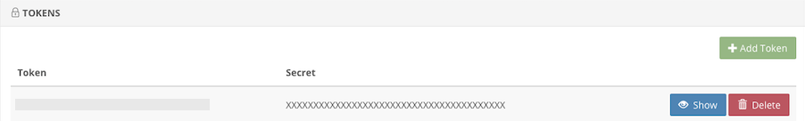
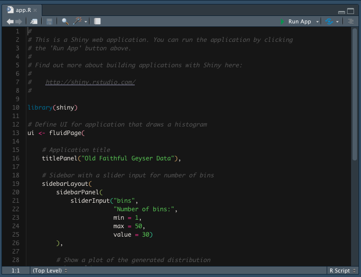
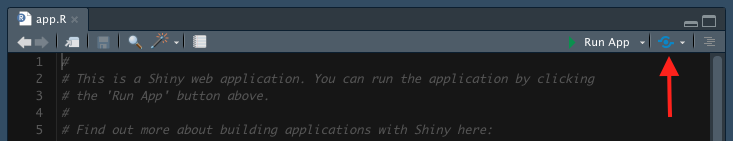

\newpage

# Introduction

shinyapps.io is a platform for hosting {shiny} applications. Broadly, the platform places your code on computers hosted by Amazon's Web Services. These cloud computers, called instances, have R installed and are activated when a user visits the URL associated with your {shiny} application. shinyapps.io is managed by RStudio, the company, and integrates nicely with RStudio, the integrated development environment.

The following section describes how to publish shiny applications online using shinyapps.io in four steps. For further reading, please visit the [official documentation](https://shiny.rstudio.com/articles/shinyapps.html). Please note that, in this tutorial, I assume you already have an account with shinyapps.io and use RStudio as your IDE.

# Publishing Your First Application

## 1. Install the `rsconnect` package

Open up RStudio and type in your console `install.packages("rsconnect")`.

## 2. Retrieve your shinyapps.io Account Token

Open shinyapps.io in the browser, click on the "Account" button in the left-hand side navigation bar. Drop-down menus containing fields like "Profile" and "Tokens" should appear. Click on "Tokens".

A menu with the available tokens for your account should appear. If none exist, click the green "Add Token" button. If one exists, click the blue "Show" button.

A pop-up will appear with a snippet-of-code beginning with `rsconnect::setAccountInfo`. Next to that snippet, on the right, there is a green button "Copy to clipboard". Click it, copy the code from the pop-up, and paste it into your R console.

 

## 3. Create a Shiny Application

Returning to RStudio, click "File \> New File \> Shiny Web App..." A pop-up like the one below should appear. Here, I am creating a single file application with the name "my-first-shiny-app" and am saving it to the folder "R" on my Desktop. You should adjust this to fit your needs.

After clicking "Create", a folder will appear in the designated location containing either the single file "app.R" or two files "ui.R" and "server.R". The top of my app.R file looks like this:

## 4. Publish the Application

In order to deploy this app to shinyapps.io, click on the blue button to the right of "Run App" at the top.

A popup should appear that looks something like this:

Once you click the "Publish" button, a panel in your RStudio will appear titled "Deploy" and will show you the status of the deployment. Note that the box "Launch browser" in the bottom left-hand-side is checked off. Once your app has deployed to shinyapps.io, your browser will open to the application. The "Title" field in the popup shown above controls part of the URL for your application. For example, if your shinyapps.io username is "tucker-tux", then this application could be visited at https://tucker-tux.shinyapps.io/my-first-shiny-app.

# Conclusion

Thanks for reading my blog post! I hope you'll find this brief walk-through of getting started with shinyapps.io helpful. If you have any questions or feedback, please leave a comment below! For more
of my work, please check out my [GitHub](https://github.com/jdtrat/). If you want to chat about anything (including neuroscience, \#rstats, piano, or my cat), DM me on [Twitter](https://twitter.com/jdtrat). Need help with an \#rstats or {shiny} project? I'm available for consulting -- just [send me an email](mailto:jdt@jdtrat.com)!
