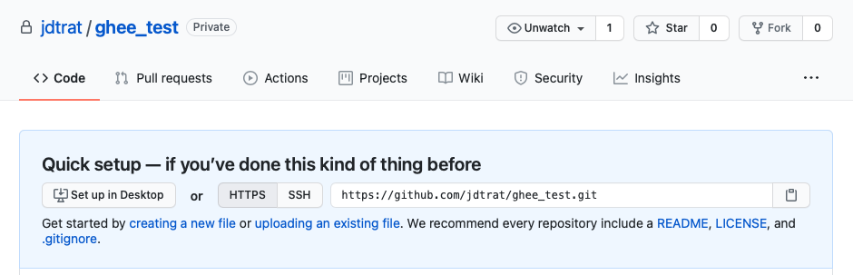

```{r setup, include=FALSE}
knitr::opts_chunk$set(echo = TRUE, eval = FALSE)
```

I recently began using Github for more collaborative work. I was constantly leaving RStudio, opening up a browser, navigating to my repo-of-choice, and creating or commenting on issues, inviting people to a repository, etc. Around the same time, I joined [Colin Fay](https://colinfay.me), and \#rstats users around the world in [running a 5K by closing Github Issues](https://github.com/ColinFay/ur-first-5k). Every week, we would get a new, customized, issue with a training plan. Naturally, I looked at the source code and saw that Colin automated most of it with the [{gh}](http://gh.r-lib.org/) package.

{gh} provides an extremely flexible API[^1] interface for Github. It allows you to perform [hundreds of actions](https://docs.github.com/en/rest/overview/endpoints-available-for-github-apps) involving organizations, teams, repos, and more. It also requires syntax that -- to me at least -- can be confusing. So, inspired by [Jenny Bryan](https://jennybryan.org) and [Jim Hester](http://jimhester.com/)'s [book](http://happygitwithr.com/), I developed {ghee}.

[^1]: An API, or Application Programming Interface, allows you to access certain features of a program, e.g. Google Drive or Github, from outside of its user-interface. The package [{googledrive}](http://googledrive.tidyverse.org/), for example, allows you to read, write, and manipulate files in your Google Drive Account from R.

## What is {ghee}?

> {ghee} is a user-friendly wrapper for the {gh} package that provides client access to Github's REST API for common tasks such as creating issues and inviting collaborators.

I chose the name {ghee} for a couple reasons. One, my neighbor loves using ghee (clarified butter) to cook with, and I've become a fan. Two, I think it makes it easy to switch between this package and its underlying one, {gh}, if you need to perform unsupported actions.

<div align = "center">
`r emo::ji("scream")` Unsupported actions? What? `r emo::ji("scream")`
</div>

Well, this package is **not** meant to replace {gh} or be an exhaustive API interface. It is designed to help you achieve common tasks with GitHub easily. As such, all functions begin with the prefix `gh_`, followed by categories of actions such as `collab` and `issue`. This allows you to take advantage of RStudio's auto-completion feature and quickly accomplish your goals.

## How do you install {ghee}?

The source code for {ghee} is [on my GitHub repo](https://github.com/jdtrat/ghee), and the development version of it can be installed and loaded as follows:

``` {.r}
# Install the development version from GitHub
remotes::install_github("jdtrat/ghee")

# Load package
library(ghee)
```

## What are use cases for {ghee}?

### Collaboration

I've found it particularly helpful to use {ghee} when working with collaborators. Normally, to invite someone to a repo, I would have to navigate to its page on Github, go to settings, manage access, and send an invitation manually. With {ghee}, though, it's as simple as specifying the repo and the invitee:

```{r gh_collab_invite-individual, eval = FALSE}

gh_collab_invite(path = "owner/repository",
                 invitee = "bestfriend")
```

If you wanted to invite multiple friends at once, you could do so in a functional programming style. Here's an example with the [{purrr}](http://purrr.tidyverse.org/) package, which simply calls the `gh_collab_invite()` for each entry in the friends vector.

```{r gh_collab_invite-multiple, eval = FALSE}

friends <- c("friend", "pal", "amigo")
purrr::walk(.x = friends, 
            ~ gh_collab_invite(path = "owner/repository", invitee = .x))
```

### Repositories

{ghee} provides functions to create, edit, and delete repositories. As an example, I'll create a repo called "ghee_test," as seen below.

```{r gh_repos_create}

# Create a Private Repo
gh_repos_create(path = "jdtrat/ghee_test", private = TRUE, description = "A test repository.")
```


Note how the above picture shows an "Issues" tab. I don't really want feedback on this repository, so I'm going to disable it with the `gh_repos_mutate()` function.

```{r gh_repos_mutate-issues}
# Disable Issues
gh_repos_mutate(path = "jdtrat/ghee_test", has_issues = FALSE)
```



If you decide you don't want a private repo anymore, no problem! That's an easy change! In the picture below, you can see the private badge next to the title is gone.

```{r gh_repos_mutate-private}
# Change Privacy Settings
gh_repos_mutate(path = "jdtrat/ghee_test", private = FALSE)
```


Now, I know what you're thinking. You don't like the repo name "ghee_test." I don't blame you. Let's change it! Voila! It's now "ghee_testing."

```{r gh_repos_mutate-name}
# Change Repo Name
gh_repos_mutate(path = "jdtrat/ghee_test", name = "ghee_testing")
```


For more repository manipulation options, check out GitHub's API [here](https://docs.github.com/en/rest/reference/repos#update-a-repository). You can also look at the documentation for `gh_repos_mutate()`, which expands upon the above examples.

{ghee} also has a function to delete repositories, though it should be *used with caution*, as it is [**permanent**]{.ul}. Further, if you want to use it, you will need to create a special GitHub PAT with the [appropriate permissions](https://docs.github.com/en/github/administering-a-repository/deleting-a-repository). This can be done with the with the [{usethis}](http://usethis.r-lib.org) package as follows: `usethis::create_github_token(scopes = "delete_repo")`.

### Issues

Another big component of GitHub are Issues. {ghee} includes some helper functions for interacting with them. These include, `gh_issue_list()`, `gh_issue_new()`, `gh_issue_comment()`, and `gh_issue_assign()`. The first function, perhaps unsurprisingly, lists the GitHub issues for a specific repo. The next one allows you to create a new issue, and the other two allow you to comment on or assign existing ones. For example, if I wanted to create an issue for my [{shinysurveys}](https://github.com/jdtrat/shinysurveys) package, I could do so as follows:

```{r gh_issues_new, eval = FALSE}

gh_issue_new(path = "jdtrat/shinysurveys", 
             title = "My Issue Title", 
             body = "Just wanted to pop on and say I love your package!")

```

To assign that issue to myself, or respond to it, I would use the issue number (which I could get with `gh_issue_list()`) and do something like this:

```{r gh_issues_extra}

gh_issue_assign(path = "jdtrat/shinysurveys",
                issue_number = 5, 
                assignees = "jdtrat")

gh_issue_comment(path = "jdtrat/shinysurveys", 
                 issue_number = 5, 
                 body = "Thanks, @jdtrat!")
```

## Happy Git(Hub)ing!

Thanks for reading my blog post! I hope you find use for {ghee} in your day-to-day. If you have any feedback, I'd love for you to file an issue (bonus points if you use `gh_issue_new()`!). For more of my work, check out my [GitHub](https://github.com/jdtrat)! If you want to chat about anything (including neuroscience, \#rstats, piano, or my new kitten), DM me on [Twitter](https://twitter.com/jdtrat)! Most importantly, Happy Git(Hub)ing!
