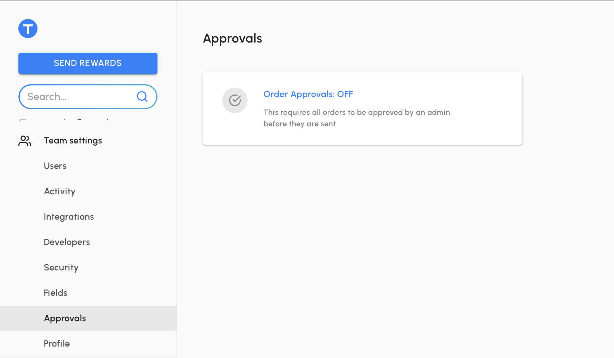
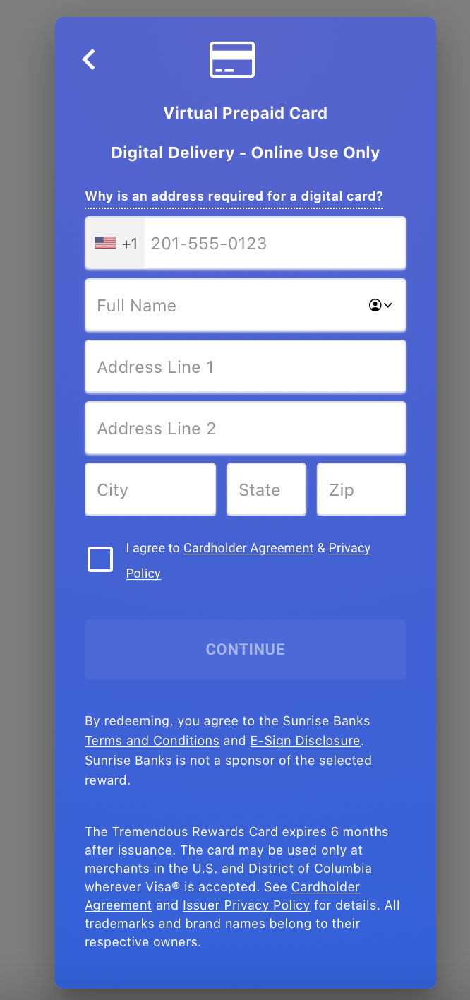

```{r setup, include=FALSE}
knitr::opts_chunk$set(echo = TRUE, eval = FALSE)
```

# Introduction

I was recently asked to explore alternatives for [Amazon's Mechanical Turk](https://www.mturk.com) and [Prolific](https://www.prolific.co) with the goal of recruiting people from targeted populations to participate in behavioral tasks. As a dedicated \#rstats user, I've been developing these tasks using [shiny](https://shiny.rstudio.com) and [shinysurveys](http://shinysurveys.jdtrat.com/). One challenge was how to compensate people for their time. That's where [Tremendous](https://www.tremendous.com/) comes in. Tremendous is a platform that "empowers companies to buy, track, and manage digital and physical payments." They provide an API that allows you to send and manage rewards dynamically, which is exactly what I needed.

There was not an API wrapper for R yet, so I wrote tremendousr to provide a (slightly-opinionated) interface for Tremendous's API. In this post, I'll briefly walk-through how to get started sending rewards. Much of the information is available in the [README](https://tremendousr.jdtrat.com/index.html), and I cover additional examples certain API endpoints, in the ["Getting Started" vignette](https://tremendousr.jdtrat.com/articles/tremendousr.html).

> A note on package conventions: All functions begin with the prefix `trem_`, followed by categories such as `client` or action verbs such as `get` or `post`. This allows you to take advantage of RStudio's auto-completion feature and quickly accomplish your goals.

## How do you Install 'tremendousr'?

You can install tremendousr via CRAN or GitHub and load it as follows:

``` {.r}
# Install released version from CRAN
install.packages("tremendousr")

# Or, install the development version from GitHub
remotes::install_github("jdtrat/tremendousr")

# Load package
library(tremendousr)
```

# Sending your First Payment

## Background

Tremendous provides two environments for their platform:

-   'Sandbox' environment, a "free and fully-featured environment for application development and testing."

-   'Production' environment, where real payments can be sent.

> Tremendous API users typically develop their applications against the sandbox environment, and then switch their credentials to production when they are ready to go live.

To begin, you must create a Tremendous account. For the sandbox environment, you can sign up or log-in [here](https://app.testflight.tremendous.com/) and generate an API key by navigating to **Team Settings \> Developers** and clicking on **Add API key** on the top right. You can follow the official documentation [here](https://developers.tremendous.com/reference/making-your-first-request#key--getting-an-api-key).

With an API key, you can create a Tremendous Client in R and begin interacting with Tremendous.

## Create a Tremendous Client

In order to send a payment, or access other features of Tremendous, you must use a Tremendous Client, which you can create with the function `trem_client_new()`. This is a convenient way to bundle your authentication (API) credentials and ensure you are using the proper environment (sandbox or production) for your calls. Conveniently, Tremendous prefixes API keys for each environment to differentiate them. If you're using the sandbox environment, your API key would begin with `TEST_`; the production environment key will begin with `PROD_`.

```{r create-test-client, eval = FALSE}

# You can (and should) set this API key as an environmental variable, which is covered later in this blog post. 
test_client <- trem_client_new(api_key = "TEST_YOUR-KEY-HERE",
                               sandbox = TRUE)
# Print Tremendous API Client
test_client
```

```{r, eval = FALSE}
#> <tremendousClient>
#>  API key: <private>
#>  API Environment: Sandbox
```

## Sending a Reward

In Tremendous, rewards start out as *orders* which contain information about the recipient such as the reward amount and type, funding source, delivery method, and a payment description id (what they refer to as an 'external id'). Orders can be fulfilled either immediately or upon approval by your Tremendous account administrator. To turn on approvals (assuming you're the admin), logon to your Tremendous account and navigate to **Team Settings \> Approvals** and click **Order Approvals: OFF** to toggle it on.



In general, when working in the sandbox environment, I would not require order approvals. I think not doing so makes it easier to refine payment methods, reward options, etc. more quickly.[^1] To take my own advice, in this post, I'll keep orders approval off. Either way, though, to create an order and have the reward send (immediately or upon approval), you should use the function `trem_send_reward()` as follows:

[^1]: When you are ready to send actual rewards within the 'Production' environment, you may wish to have this feature enabled, especially if you will be automating reward delivery as an extra layer of protection.

```{r trem_send_reward, eval = FALSE}
trem_send_reward(client = test_client,
             name = "first last",
             email = "email@website.com",
             reward_amount = 10,
             currency_code = "USD",
             delivery_method = "EMAIL",
             payment_description_id = "payment-from-intro-to-tremendousr",
             funding_source_id = "your-funding-id-from-tremendous",
             reward_types = "Q24BD9EZ332JT", # ID for virtual visa gift card
             parse = TRUE # Return a parsed API response
             )
```

Under the hood, this function performs a POST request for creating an order using Tremendous.[^2] For detailed documentation on each field, I encourage you to check out the function's help documentation (`?trem_send_reward`) or the official [Tremendous documentation](https://developers.tremendous.com/reference/core-orders-create).

[^2]: The help documentation for `trem_post()` actually shows an example of sending a reward manually. I find this wrapper function easier to work with, though, than nested lists 😅

In sending this to myself, I get an email with a link to a redeem a Visa gift card:



# Thoughts, Tips, and Tricks

I have really enjoyed working with the Tremendous API and found it quite intuitive. As such, for many of the endpoints, I have opted (for now, at least) to not create wrapper functions since they will not save a lot, if any, time. For example, to list your reward history you would call:

```{r get_reward-history, eval = FALSE}
trem_get(test_client, "rewards")
```

To access a specific reward's information, you would simply append the reward ID:

```{r get_specific-reward, eval = FALSE}
trem_get(test_client, "rewards/REWARD_ID")
```

In a future release of tremendousr, perhaps I will wrap this in a utility function such as `trem_get_reward()`, but I think the current implementation is user-friendly and encourages checking the [API documentation](https://developers.tremendous.com/) 🤓

## Setting your API key

It is best practice to **never** include your API key within your R script in the event you inadvertently share it. To help with this, I include a utility function, `trem_set_api_key()`, which can (and should) be used as follows.

```{r show_trem-set-api-key, eval = FALSE}
trem_set_api_key("TEST_YOUR-KEY-HERE")
#> • You may wish to add your Tremendous Test API key to your '.Renviron' file:
#> TREMENDOUS_TEST_KEY=TEST_YOUR-KEY-HERE
#> [Copied to clipboard]
#> • To edit your '.Renviron' file:
#> - Check that usethis is installed.
#> - Call `usethis::edit_r_environ()`.
#> - Check that '.Renviron' ends with a new line.

# Now create your client with api_key = NULL (default value) so the environmental variable is used.
test_client <- trem_client_new(api_key = NULL, # Accesses environmental variable
                               sandbox = TRUE)
```

## Setting a Funding ID

In the sandbox environment, from what I understand, there is only one funding source (with a \$5,000 limit that resets daily). Using the `trem_get()` function, you can easily define a variable to plug into `trem_send_reward()`.

```{r define-funding-id, eval = FALSE}

funding_id <- trem_get(test_client, "funding_sources")$funding_sources$id

```

## Finding Payment Methods

Tremendous offers support for over 600 reward types, including Virtual Visa, Starbucks, and Amazon gift cards, as well as ACH transfers. When sending a reward, you can define as many reward types, using a character vector of the ID, which will allow them to choose what they prefer.

I think the easiest way of finding reward types is by browsing their [online catalog](https://www.tremendous.com/catalog). Using the name, you can then access their IDs as shown below. For this example, I'll get the IDs for 'Best Buy', 'Virtual Visa', and 'Target' gift cards, making sure the currency is US dollars. I'm going to use the package [dplyr](https://dplyr.tidyverse.org) for easy data manipulation and to show how you can use the pipe[^3] to pass the Tremendous API client around.

[^3]: From [magrittr](https://magrittr.tidyverse.org)

```{r get-products-demo, eval = FALSE}
library(dplyr)
library(magrittr)

# Save the current product listing as 'prods'
prods <- test_client %>%
  trem_get("products")

# Access the 'products' data frame of prods and filter it to desired reward types, assigning the IDs as 'reward_ids'.
reward_ids <- prods$products %>% 
  # Filter so the name is either "Virtual Visa", "Target", or "Best Buy" AND the currency code is "USD"
  filter(name %in% c("Virtual Visa", "Target", "Best Buy") & currency_codes == "USD") %>% 
  # Grab the IDs
  pull(id)

```

I did not include the product data in the package because -- from my understanding -- the IDs, and available options, are subject to change.

## Have a ✨Tremendous✨ Day!

Thanks for reading my blog post! I hope you find use for tremendousr (and, of course, Tremendous). If you have any feedback, I'd love for you to [file an issue](https://github.com/jdtrat/tremendousr/issues/new). For more of my work, check out my [GitHub](https://github.com/jdtrat)! If you want to chat about anything (including neuroscience, \#rstats, piano, or my kitten), DM me on [Twitter](https://twitter.com/jdtrat)! Lastly, if you need help with an \#rstats or shiny project, I'm available for consulting -- just [send me an email](mailto:jdt@jdtrat.com)!
