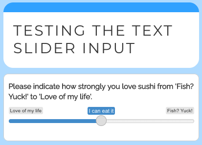

# New version, who's this? 

I'm thrilled to the release of shinysurveys 0.2.0! shinysurveys provides easy-to-use, minimalistic code for creating and deploying surveys in R with [shiny](https://shiny.rstudio.com/).

You can install and load the current version of shinysurveys from CRAN as follows:

``` {r install-shinysurveys, eval = FALSE}
# Install released version from CRAN
install.packages("shinysurveys")
library(shinysurveys)
```

shinysurveys has some really great new features. Notably, support for custom input (question) types, multi-paged surveys, and automatic response aggregation. For a full list of changes and new features, check out the [release  notes](https://shinysurveys.jdtrat.com/news/index.html).

## Custom Input Types

The original idea for {shinysurveys} was to provide a select set of well-supported input types that are commonly used with surveys. In response to additional input type requests, I developed a framework for survey designers to define their own input types to meet individual use cases. 

Consider the question "On a scale from 1-10, how much do you love sushi?". An ideal input type would be {shiny}'s `sliderInput`. However, this is not natively supported by {shinysurveys} as the slider input requires multiple arguments, including a minimum, maximum, and starting value. To get around this, we can define a new input type using a new function `extendInputType()`. This function accepts two arguments. The first, `input_type`, is a string of the input type used in the questions data frame. The second is the input definition. Consider:

```{r extend-input-type-slider, eval = FALSE}

# Register a slider input to {shinysurveys} with a custom minimum and maximum value.
extendInputType(input_type = "slider", {
  shiny::sliderInput(
    inputId = surveyID(),
    label = surveyLabel(),
    min = 1,
    max = 10,
    value = 5
    ) 
})

```

Note the inputId and label are set to `surveyID()` and `surveyLabel()`, respectively. These are necessary helper functions to ensure that survey features such as required questions function properly. As such, **all extensions need `inputId = surveyID()` and `label = surveyLabel()`.**

As in a typical shiny survey, we can define our question as follows:

```{r define-question, eval = FALSE}
# Define a question as normal with the `input_type` set to "slider", which is not natively supported by {shinysurveys}.

slider_question <- data.frame(
  question = "On a scale from 1-10, how much do you love sushi?",
  option = NA,
  input_type = "slider",
  input_id = "sushi_scale",
  dependence = NA,
  dependence_value = NA,
  required = TRUE
  )
```

When running the full application, we see the following survey:



For more thorough documentation on extending shinysurveys with custom inputs, please see my [blog post](https://www.jdtrat.com/blog/extending-shinysurveys/) or the [vignette](https://shinysurveys.jdtrat.com/articles/custom-input-extensions.html).

## Multi-Paged Surveys

shinysurveys now supports surveys spanning multiple pages. To use, a 'page' column must be added to the data frame of questions supplied to `surveyOutput()` The column can either have numeric `(e.g. c(1, 1, 2, 3))` or character values (`c("intro", "intro", "middle", "final")`). Consider:

**Single-Paged Question Data Frame:**

```{r single-paged, echo = FALSE}

data.frame(question = c("What is your name?","What is your favorite food?"),
                 option = NA,
                 input_type = "text",
                 input_id = c("name", "favorite_food"),
                 dependence = NA,
                 dependence_value = NA,
                 required = F) %>%
  kableExtra::kbl(format = 'html') %>%
  kableExtra::kable_styling()

```

**Multi-Paged Question Data Frame:**

```{r multipaged, echo = FALSE}
data.frame(question = c("What is your name?","What is your favorite food?"),
                 option = NA,
                 input_type = "text",
                 input_id = c("name", "favorite_food"),
                 dependence = NA,
                 dependence_value = NA,
                 required = F,
                 page = c(1, 2)) %>%
  kableExtra::kbl(format = 'html') %>%
  kableExtra::kable_styling()
```

For more thorough documentation on creating a multi-paged survey, please see my [blog post](https://www.jdtrat.com/blog/multi-paged-shinysurvey/).

## Automatic Response Aggregation

In large part, shinysurveys was developed to help bridge the gap between data collection ad analysis. To help survey designers more quickly gain insights of the results, I've developed a function `getSurveyData()` to easily aggregate survey responses in a common structure, inspired by tidy data, where each row is an observation (question) and each column is a variable.

The ‘subject_id’ column can be used for identifying respondents. The ‘question_id’ and ‘question_type’ columns correspond to ‘input_id’ and ‘input_type’ from the original data frame of questions. The ‘response’ column is the participant’s answer. Consider the following example:

```{r response-aggregation-demo, eval = FALSE}

# Load packages
library(shiny)
library(shinysurveys)

# Define questions in the format of a shinysurvey
survey_questions <- data.frame(
  question = c("What is your favorite food?",
               "What's your name?"),
  option = NA,
  input_type = "text",
  input_id = c("favorite_food", "name"),
  dependence = NA,
  dependence_value = NA,
  required = c(TRUE, FALSE)
)

# Define shiny UI
ui <- fluidPage(
  surveyOutput(survey_questions,
               survey_title = "Hello, World!",
               survey_description = "A demo survey")
)

# Define shiny server
server <- function(input, output, session) {
  renderSurvey()
  
  observeEvent(input$submit, {
    response_data <- getSurveyData(custom_id = "test")
    print(response_data)
  })
  
}

# Run the shiny application
shinyApp(ui, server)
```

In the browser, the survey looks like this:


When I answer the survey and click submit, the following data frame is printed to the console, following the format described above.

| subject_id |  question_id  | question_type | response |
|:----------:|:-------------:|:-------------:|:--------:|
| test | favorite_food |     text      |  Sushi   |
| test |     name      |     text      |    JT    |

For more thorough documentation on aggregating survey responses, please see the [vignette](https://shinysurveys.jdtrat.com/articles/get-survey-data.html).


# Conclusion

I hope you'll find these new features shinysurveys useful! If you have any feedback, I'd love for you to file an [issue](https://github.com/jdtrat/shinysurveys/issues). For more of my work, please check out my [GitHub](https://github.com/jdtrat/). If you want to chat about anything (including neuroscience, \#rstats, piano, or my cat), DM me on [Twitter](https://twitter.com/jdtrat). Need help with an \#rstats or {shiny} project? I'm available for consulting
-- just [send me an email](mailto:jdt@jdtrat.com)!

# Acknowledgements

Thanks to the following people for their feedback and contributions through comments and issues:

[\@LucyMcGowan](https://github.com/LucyMcGowan), [\@MayaGans](https://github.com/MayaGans), [\@nstrayer](https://github.com/nstrayer), [\@nklepeis](https://github.com/nklepeis), [\@muschellij2](https://github.com/muschellij2), [\@priyankagagneja](https://github.com/priyankagagneja), and [\@miiichaellam](https://github.com/miiichaellam).