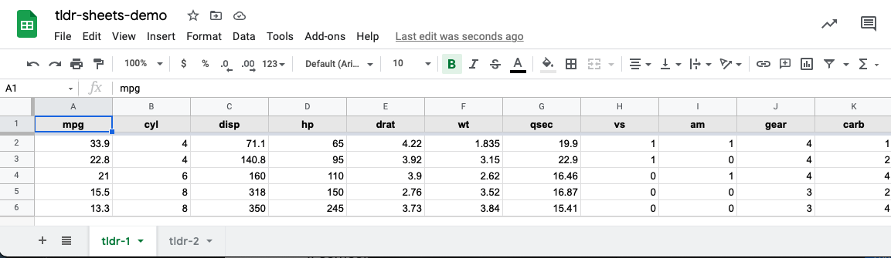
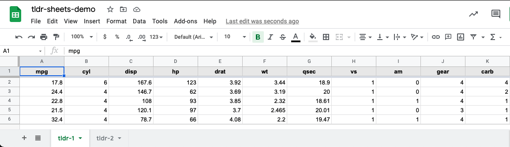

```{r setup, include=FALSE}
knitr::opts_chunk$set(echo = TRUE)
```

# Introduction

Over the weekend, I published [a blog post](https://www.jdtrat.com/blog/connect-shiny-google/) that walked-through how to save data from a shiny app to Google Sheets. Working on it reminded me of some challenges I've faced reading and writing data to and from Google Sheets. Often, they involved the distinction between a 'Spreadsheet' and a 'Worksheet'. In this post, I briefly cover the distinction between these (and their correlate in Microsoft Excel), share my thoughts on which method is better -- whichever meets your use-case! -- and introduce a utility function, wrapping the R package [googlesheets4](https://googlesheets4.tidyverse.org/),) for aggregating data from multiple worksheets.

## Terminology

### Excel

If you use Microsoft Excel, I imagine these terms are somewhat familiar to you. In Excel, you have a 'Workbook', which contains multiple, often-related spreadsheets. The tabs at the bottom -- each of which may have a different name. When creating a new Excel file, you can see the default name of the window is "Book1," and there are tabs at the bottom initially labeled "Sheet1", "Sheet2", and "Sheet3":


### Google Sheets

In Google Sheets, the concept of a 'Spreadsheet' and 'Worksheet' are similar to those of Microsoft Excel, though the terms are -- unfortunately -- reversed. In Google Sheets, for example, I created a 'spreadsheet' called, "blog-demo_google-spreadsheets," which contains multiple 'worksheets', titled 'demo-sheet-1', 'demo-sheet-2', 'demo-sheet-3', etc:


# Working with Google Sheets

Before you can save data to Google Sheets, you need to have a spreadsheet. Using googlesheets4, you can create the same sheet as seen above as follows:[^1]

[^1]: Note: I'm assuming that you have already authenticated your Google Account using both `googledrive::drive_auth()` and `googlesheets4::gs4_auth()`. The former is required to use user-friendly names when specifying Google Sheets to write, as we will see later. See [this vignette](https://googlesheets4.tidyverse.org/articles/articles/drive-and-sheets.html) for more details.

```{r create-sheet, eval = FALSE}

# Create a Google Sheet "tldr-sheets-demo"
# with two worksheets (tabs) titled "tldr-1" and "tldr-2"
googlesheets4::gs4_create(name = "tldr-sheets-demo",
                          sheets = c("tldr-1", 
                                     "tldr-2")
                          )

```

Per the documentation, the `name` parameter defines the name of the spreadsheet and the `sheets` argument specifies which worksheets to create. If unspecified, it will create an empty spreadsheet with the name "Sheet1".[^2]

[^2]: Side note: 'tldr' is a reference to "too long, didn't read" which was originally a section where I would cover the highlights. Now, the whole post is that section...😅

Let's say I want to write a random subset of the `mtcars` data frame. I'll define a function that will randomly select `num_rows` from a data frame:

```{r random-subset-function}

random_subset <- function(data, num_rows) {
  if (num_rows > nrow(data)) {
    stop("Can't randomly select more rows than are available.")
  }
  subset <- sample(1:nrow(data), size = num_rows, replace = FALSE)
  data[subset,]
}

```

With the data ready to go, I'll need a Sheet ID. The easiest way to get this is as follows: `googledrive::drive_get("your-sheet-name")`. For our example, we'll save it as a variable:

```{r save-tldr-sheet-id, eval = FALSE}
tldr_sheet_id <- googledrive::drive_get("tldr-sheets-demo")
```

Now we are ready to store our data on Google Sheets! We can store data within the same worksheet or in separate ones. Below I provide overviews of each method, and how I approach writing to and reading from them.

## Same Worksheet

### Writing Data

#### Default Behavior: Overwrite Existing Data

If we wanted to write `mtcars` to the "tldr-1" worksheet, we can do so as follows:

```{r tldr-1-write, eval = FALSE}

# Write 5 random rows of mtcars to 'tldr-1' worksheet
googlesheets4::sheet_write(data = random_subset(mtcars, 5),
                           ss = tldr_sheet_id,
                           sheet = "tldr-1")
```

If we take a look at the spreadsheet online, we can see the data looks like this:



By default, if recalling `sheet_write()` with the same sheet argument will overwrite existing data:

```{r tldr-1-overwrite, eval = FALSE}

# Overwrite 5 random rows of mtcars to 'tldr-1' worksheet
googlesheets4::sheet_write(data = random_subset(mtcars, 5),
                           ss = tldr_sheet_id,
                           sheet = "tldr-1")
```



#### Fancy Behavior: Append Data

Instead of using the default behavior to overwrite the data, you could append it -- assuming it's the same structure. For example, to append data to 'tldr-1', I often use the following structure:

```{r append-tldr-1, eval = FALSE}

# Read our sheet
values <- googlesheets4::read_sheet(ss = tldr_sheet_id, 
                                    sheet = "tldr-1")

# Check to see if our sheet has any existing data.
# If not, let's write to it and set up column names. 
# Otherwise, let's append to it.

if (nrow(values) == 0) {
  googlesheets4::sheet_write(
    data = random_subset(mtcars, 5),
    ss = tldr_sheet_id,
    sheet = "tldr-1"
    )
  } else {
    googlesheets4::sheet_append(
      data = random_subset(mtcars, 5),
      ss = tldr_sheet_id,
      sheet = "tldr-1"
    )
  }

```

### Reading Data

Reading data from the same sheet is pretty easy. As we saw in the code chunk on appending data, you can use the `read_sheet()` function, specifying the sheet:

```{r read-same-sheet, eval = FALSE}

googlesheets4::read_sheet(tldr_sheet_id,
                          sheet = "tldr-1")

```

If you don't specify the sheet argument, it will default to the first visible sheet (in this case, 'tldr-1').

## Different Worksheets

### Writing Data

#### Default Behavior

You can write data to a new worksheet, within the same spreadsheet, each time you call the function. By default, a new worksheet will be created following the pattern "Sheet1", "Sheet2", etc.

```{r write-data-to-new-worksheets, eval = FALSE}

# Write 5 random rows of mtcars to new worksheets each time

# "Sheet1"
googlesheets4::sheet_write(data = random_subset(mtcars, 5),
                           ss = tldr_sheet_id)

# "Sheet2"
googlesheets4::sheet_write(data = random_subset(mtcars, 5),
                           ss = tldr_sheet_id)

# "Sheet3"
googlesheets4::sheet_write(data = random_subset(mtcars, 5),
                           ss = tldr_sheet_id)

```

#### Fancy Behavior

If you wanted to write data to a new worksheet with a specific name, you could pass in the `sheet` argument as follows. This is useful for keeping tack of related observations.

```{r write-fancy-individual-sheets, eval = FALSE}

# Write 5 random rows of mtcars to new worksheets each time
googlesheets4::sheet_write(data = random_subset(mtcars, 5),
                           ss = tldr_sheet_id,
                           sheet = "my-sheet-name-1")

googlesheets4::sheet_write(data = random_subset(mtcars, 5),
                           ss = tldr_sheet_id,
                           sheet = "my-sheet-name-2")

googlesheets4::sheet_write(data = random_subset(mtcars, 5),
                           ss = tldr_sheet_id,
                           sheet = "my-sheet-name-3")

```

### Reading Data

As far as I know, there is not an out-of-the-📦 solution for reading data from multiple worksheets within a single spreadsheet. However, here's a wrapper I wrote for easily aggregating different worksheet data, which I've found useful on a number of occasions:

```{r function-sheet_combine}

sheet_combine <- function(ss, FUN, ...) {
  worksheets <- googlesheets4::sheet_names(ss)
  sh_contents <- purrr::map(worksheets, function(name) {
    googlesheets4::read_sheet(ss = ss,
                              sheet = name)
  })
  purrr::reduce(sh_contents, FUN, ...)
}

```

Since the data is similarly structured across all worksheets, we can use the function as follows to combine all worksheet data into a single data frame:

```{r actually-combine-sheets, eval = FALSE}

sheet_combine(tldr_sheet_id, rbind)

```

To try this out for yourself, copy and paste the following into your console (along with the function definition from above):

```{r example-combine-sheets, eval = FALSE}

my_sheet <- gs4_create("combine-my-sheets")

# Write the first five rows of mtcars
# to the worksheet 'first-five'
sheet_write(data = mtcars[1:5,],
            ss = my_sheet,
            sheet = "first-five")

sheet_write(data = mtcars[6:10,],
            ss = my_sheet,
            sheet = "second-five")

# Bind the rows from each worksheet
# to return a data frame with the first
# ten rows of mtcars
sheet_combine(ss = my_sheet,
              FUN = rbind)

# clean up
my_sheet %>%
  googledrive::drive_trash()

```

## Which approach should I use?

Short answer: whichever is best for you! I think there are benefits to storing data in the same worksheet and in different ones, and it's really context dependent. That is, think about which best meets your use case. If there isn't a clear benefit to one over another, I'm generally a fan of using different worksheets. I often work with behavioral data as part of neuroscience or psychology studies and find I like the compartmentalization of each person's data in a new worksheet. I may set the sheet name equal to their participant ID, for example. As needed, I can go back and easily combine all the data with the function defined above, `sheet_combine()`.

## Conclusion

To recap, I briefly outlined two approaches I use for storing data with Google Sheets using the `googlesheets4` package. I introduced a utility function for aggregating data across individual worksheets and provided an example for you to try yourself.

If you have any feedback, please leave a comment below! For more of my work, please check out my [GitHub](https://github.com/jdtrat/). If you want to chat about anything (including neuroscience, \#rstats, piano, or my cat), DM me on [Twitter](https://twitter.com/jdtrat). Need help with an \#rstats or Shiny project? I'm available for consulting -- just [send me an email](mailto:jdt@jdtrat.com)!
