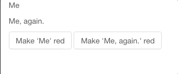

class: inverse center middle

# Shiny + JavaScript

.large[Jonathan Trattner | 03-04-2021]

```{r setup-main, include=FALSE}
options(htmltools.dir.version = FALSE)
```

```{r meta, echo=FALSE}
library(metathis)
metathis::include_meta(
  meta() %>%
  meta_general(
    description = "A brief introduction for integrating JavaScript with Shiny.",
    generator = "xaringan and remark.js"
  ) %>% 
  meta_social(
    title = "Shiny + JavaScript",
    url = "https://jdtrat.com/talks/shiny-js/slides.html",
    image = "https://jdtrat.com/talks/shiny-js/cover.png",
    image_alt = "The title slide for the Shiny + JavaScript talk. It's a blue background with the title in gold text. Underneath, the author's name, Jonathan Trattner, and the date originally presented, 3-4-2021, is in white text.",
    og_type = "website",
    og_author = "Jonathan David Trattner",
    twitter_card_type = "summary_large_image",
    twitter_creator = "@jdtrat"
  )
)
```

---
class: inverse center middle

# Introduction `r emo::ji("wave")`

???
  
Comments can go here!

---
name: theme
layout: true
.my-header[
]

.my-footer[
]

---
class: middle center

.my-header[
.title[
What is {shiny}?
]
]

.inset[
"{shiny} is an R package that makes it easy to build interactive web apps straight from R."<sup>1</sup>
]

.footnote[
<sup>1</sup>https://shiny.rstudio.com
]
---
class: middle center

.my-header[
.title[
What is {shiny}?
]
]

.left[
Traditional websites are built using a few different languages:

* HTML for defining the structure of websites
* CSS for customizing the aesthetics of websites
* JavaScript for controlling the behavior of websites
]

--

.question[
{shiny} and related packages<sup>1</sup> translate R to these languages.
]

.footnote[
<sup>1</sup> See [{shinythemes}](http://rstudio.github.io/shinythemes/), [{htmlwidgets}](http://www.htmlwidgets.org), and [{shinyjs}](https://deanattali.com/shinyjs/).
]
---
class: top

.my-header[
.title[
Integrating JavaScript
]
]

# Steps to Integrate JavaScript

--
`r emo::ji("one")`: What do you want to do? <br></br>
`r emo::ji("two")`: Figure out how to do it in JavaScript <br></br>
`r emo::ji("three")`: Wrap the JavaScript in `Shiny.addCustomMessageHandler` <br></br>
`r emo::ji("four")`: Call the JavaScript function from R <br></br>

--

.center[
.inset-glow[
As an example, I will show you how to add a class to an object.
]
]
---
class: top

.my-header[
.title[
Integrating JavaScript
]
]

# `r emo::ji("one")` What do you want to do?
--

* Make text .red[red] when clicking a `r emo::ji("radio_button")`.

---
class: top

.my-header[
.title[
Integrating JavaScript
]
]

# `r emo::ji("one")` What do you want to do?

* Make text .red[red] when clicking a `r emo::ji("radio_button")`.

# `r emo::ji("two")` How can you do it in JS?

```{js, eval = FALSE}
// Using Vanilla JavaScript, we can do this:
var element = document.getElementById("element");
element.classList.add("red");
```

???
Because Shiny has JQuery as a dependency, though, we can do this in an easier way!

---
class: top

.my-header[
.title[
Integrating JavaScript
]
]

# `r emo::ji("one")` What do you want to do?

* Make text .red[red] when clicking a `r emo::ji("radio_button")`.

# `r emo::ji("two")` How can you do it in JS?

```{js, eval = FALSE}
// Using Vanilla JavaScript, we can do this:
var element = document.getElementById("element"); #<<
element.classList.add("red");
```

???
Because Shiny has JQuery as a dependency, though, we can do this in an easier way!

---
class: top

.my-header[
.title[
Integrating JavaScript
]
]

# `r emo::ji("one")` What do you want to do?

* Make text .red[red] when clicking a `r emo::ji("radio_button")`.

# `r emo::ji("two")` How can you do it in JS?

```{js, eval = FALSE}
// Using Vanilla JavaScript, we can do this:
var element = document.getElementById("element");
element.classList.add("red"); #<<
```

???
Because Shiny has JQuery as a dependency, though, we can do this in an easier way!

---
class: top

.my-header[
.title[
Integrating JavaScript
]
]

# `r emo::ji("one")` What do you want to do?

* Make text .red[red] when clicking a `r emo::ji("radio_button")`.

# `r emo::ji("two")` How can you do it in JS?

```{js, eval = FALSE}
// Using JQuery, we can do this:
var element = $("#element");
element.addClass("red");
```

???
I think JQuery is nicer to work with, so I'm going to use this second method.


---
class: top

.my-header[
.title[
Integrating JavaScript
]
]

# `r emo::ji("one")` What do you want to do?

* Make text .red[red] when clicking a `r emo::ji("radio_button")`.

# `r emo::ji("two")` How can you do it in JS?

```{js, eval = FALSE}
// Using JQuery, we can do this:
var element = $("#element"); #<<
element.addClass("red");
```

???
I think JQuery is nicer to work with, so I'm going to use this second method.

---
class: top

.my-header[
.title[
Integrating JavaScript
]
]

# `r emo::ji("one")` What do you want to do?

* Make text .red[red] when clicking a `r emo::ji("radio_button")`.

# `r emo::ji("two")` How can you do it in JS?

```{js, eval = FALSE}
// Using JQuery, we can do this:
var element = $("#element"); 
element.addClass("red"); #<<
```

???
I think JQuery is nicer to work with, so I'm going to use this second method.

---
class: top

.my-header[
.title[
Integrating JavaScript
]
]

# Functionalize our JavaScript

--

```{js, eval = FALSE}

function addClass(params) { 
$("#" + params.input_id).addClass(params.class_name);
}

```

--

* Define a function that takes in an object `params`
--

  * `params` will contain an input id and class name
--

* When called, this function will add the specified class to the specified element.

???

We're presumably going to want to add classes to multiple input types, so let's go ahead and convert our addClass statement to a function that takes in the id of the element and the class name.

---
class: top

.my-header[
.title[
Integrating JavaScript
]
]

# `r emo::ji("three")` Wrap as Message Handler 

```{js, eval = FALSE}
// when JavaScript receives the message "add_class" 
// perform this function
Shiny.addCustomMessageHandler("add_class", function (params) { 
$("#" + params.input_id).addClass(params.class_name);
});
```

???

So our step one was to figure out what we want to do
Step 2 was to do it in JavaScript
Step 3 is to wrap our JavaScript code so Shiny can talk to it.

A JavaScript event handler is a way to trigger certain actions whenever a specific event occurs -- just like Shiny's observeEvent. We can tell it what to look for. In this case, we're going to define a MESSAGE handler, which just means "any time you get a message X, do Y."

So in JavaScript, we have the object "Shiny" which has different methods that we can implement. In this case, we want to add a custom message handler. So what this says is that any time the JavaScript server receives a message "add_class", ewxecute the function addClass.

Shiny.addCustomMessageHandler is basically an event handler (think an observer in Shiny) or a sensor that only responds when activated. In this case, we are setting it to activate when it receives the message "add_class".

---
class: top

.my-header[
.title[
Integrating JavaScript
]
]

# `r emo::ji("four")` Call `addClass()` from R

--
* We have our JavaScript message handler `r emo::ji("search")`
--

  * How do we trigger it?

---
class: top

.my-header[
.title[
Integrating JavaScript
]
]

# `r emo::ji("four")` Call `addClass()` from R

* We have our JavaScript message handler `r emo::ji("search")`
  * How do we trigger it?
  
```{.r}
session$sendCustomMessage()
```

???

Well, we have a message handler looking for messages on the JS side, so it makes sense that we would need to send one! We can use the `sendCustomMessage()` function to do so. But remember that our function took an argument params. Well, can easily create one with R as a list! Let's define a function:

---
class: top

.my-header[
.title[
Integrating JavaScript
]
]

# `r emo::ji("four")` Call `addClass()` from R

.instructions[
Recall our `params` object had two items: 
* `input_id`
* `class_name`
]

--

Well, let's define a function that accepts those two values:

```{r}
add_class <- function(.id, .class) {
  # What should go here?
}
```

???
Exactly! If you said that `sendCustomMessage` should go in that function, you're exactly right! Let's take a look at the full function.


---
class: top

.my-header[
.title[
Integrating JavaScript
]
]

# `r emo::ji("four")` Call `addClass()` from R

```{r}
add_class <- function(.id, .class) {
  session <- shiny::getDefaultReactiveDomain()
  session$sendCustomMessage(
    "add_class",
    list(input_id = .id,
         class_name = .class)
  )
}
```

???
Walking through this line by line. 

The first line shows the session being assigned as the default reactive domain. That's just a way to avoid passing in the Shiny object explicitly from the server.

The second line is where the magic happens, we are using the reactive session object and saying "let's send a custom message". 
This first argument is the message we want to send, and it should match the customMessageHandler that we defined on the JavaScript side. In our case, it's simply "add_class".

The second argument is what will become our params object -- it's simply a list that contains all of our arguments. In this case, the input_id and the class_name.


---
class: top

.my-header[
.title[
Integrating JavaScript
]
]

# `r emo::ji("four")` Call `addClass()` from R

```{r}
add_class <- function(.id, .class) {
  session <- shiny::getDefaultReactiveDomain() #<<
  session$sendCustomMessage(
    "add_class",
    list(input_id = .id,
         class_name = .class)
  )
}
```

???
Walking through this line by line. 

The first line shows the session being assigned as the default reactive domain. That's just a way to avoid passing in the Shiny object explicitly from the server.

The second line is where the magic happens, we are using the reactive session object and saying "let's send a custom message". 
This first argument is the message we want to send, and it should match the customMessageHandler that we defined on the JavaScript side. In our case, it's simply "add_class".

The second argument is what will become our params object -- it's simply a list that contains all of our arguments. In this case, the input_id and the class_name.

---
class: top

.my-header[
.title[
Integrating JavaScript
]
]

# `r emo::ji("four")` Call `addClass()` from R

```{r}
add_class <- function(.id, .class) {
  session <- shiny::getDefaultReactiveDomain() 
  session$sendCustomMessage( #<<
    "add_class",
    list(input_id = .id,
         class_name = .class)
  )
}
```

???
Walking through this line by line. 

The first line shows the session being assigned as the default reactive domain. That's just a way to avoid passing in the Shiny object explicitly from the server.

The second line is where the magic happens, we are using the reactive session object and saying "let's send a custom message". 
This first argument is the message we want to send, and it should match the customMessageHandler that we defined on the JavaScript side. In our case, it's simply "add_class".

The second argument is what will become our params object -- it's simply a list that contains all of our arguments. In this case, the input_id and the class_name.

---
class: top

.my-header[
.title[
Integrating JavaScript
]
]

# `r emo::ji("four")` Call `addClass()` from R

```{r}
add_class <- function(.id, .class) {
  session <- shiny::getDefaultReactiveDomain() 
  session$sendCustomMessage( #<<
    "add_class", #<<
    list(input_id = .id,
         class_name = .class)
  )
}
```

???
Walking through this line by line. 

The first line shows the session being assigned as the default reactive domain. That's just a way to avoid passing in the Shiny object explicitly from the server.

The second line is where the magic happens, we are using the reactive session object and saying "let's send a custom message". 
This first argument is the message we want to send, and it should match the customMessageHandler that we defined on the JavaScript side. In our case, it's simply "add_class".

The second argument is what will become our params object -- it's simply a list that contains all of our arguments. In this case, the input_id and the class_name.

---
class: top

.my-header[
.title[
Integrating JavaScript
]
]

# `r emo::ji("four")` Call `addClass()` from R

```{r}
add_class <- function(.id, .class) {
  session <- shiny::getDefaultReactiveDomain() 
  session$sendCustomMessage(
    "add_class",
    list(input_id = .id, #<<
         class_name = .class) #<<
  )
}
```

???
Walking through this line by line. 

The first line shows the session being assigned as the default reactive domain. That's just a way to avoid passing in the Shiny object explicitly from the server.

The second line is where the magic happens, we are using the reactive session object and saying "let's send a custom message". 
This first argument is the message we want to send, and it should match the customMessageHandler that we defined on the JavaScript side. In our case, it's simply "add_class".

The second argument is what will become our params object -- it's simply a list that contains all of our arguments. In this case, the input_id and the class_name.

---
layout: false
class: inverse middle center

# But, does this work?
.large-emoji[`r emo::ji("thinking")` `r emo::ji("thinking")` `r emo::ji("thinking")`]

???
So we've briefly walked through how to connect R and JavaScript. But, does this actually work? Well, let's see.

---
class: top
layout: theme

.my-header[
.title[
Shiny App - Demo
]
]

# User-Interface

<div style = "margin-top: -25px;"></div>
```{r, eval = FALSE}
ui <- fluidPage(
  # Add one div with id “me”
  div(id = "me", 
      p("Me")),
  # Add another div with id “me-again”
  div(id = "me-again",
      p("Me, again.")
      ),
  actionButton(inputId = "meRed", 
               "Make 'Me' red"),
  actionButton(inputId = "meAgainRed", 
               "Make 'Me, again.' red")
)
```

.my-footer[
]
---
class: top
layout: theme

.my-header[
.title[
Shiny App - Demo
]
]

# Server

<div style = "margin-top: -25px;"></div>
```{r, eval = FALSE}
server <- function(input, output, session) {
  # When the button meRed is clicked
  # add the red class to the "me" div.
  observeEvent(input$meRed, {
    add_class(.id = "me", .class = "red")
  })
  
  # When the button meAgainRed is clicked
  # add the red class to the "me-again" div.
  observeEvent(input$meAgainRed, {
    add_class(.id = "me-again", .class = "red")
  })
}

```

.my-footer[
]
---
class: top center
layout: theme

.my-header[
.title[
Shiny App - Demo
]
]

# What does this look like?



.footnote[
Code can be [found here](https://gist.github.com/jdtrat/9dcef57687772742e7227cbd373e20aa).
]

.my-footer[
]
---
class: middle
layout: theme

.my-header[
.title[
Thanks `r emo::ji("pray")` `r emo::ji("raising_hands")`
]
]

A special thank you to the wonderful people who helped me on my R/Shiny/JavaScript journey:

* [Lucy D'Agostino McGowan](https://lucymcgowan.com/) (Wake Forest University)
* [Nick Strayer](https://nickstrayer.me/) (RStudio)
* [Maya Gans](https://maya.rbind.io) (Atorus Research)
* [Dean Attali](https://deanattali.com) (AttaliTech)
* [Paul Le Grand](https://www.paullegrand.org)

.my-footer[
]
---
class: inverse center middle

# Questions?

